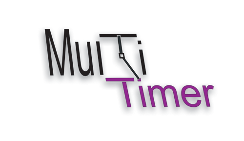
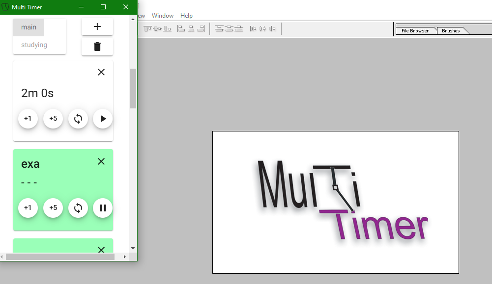
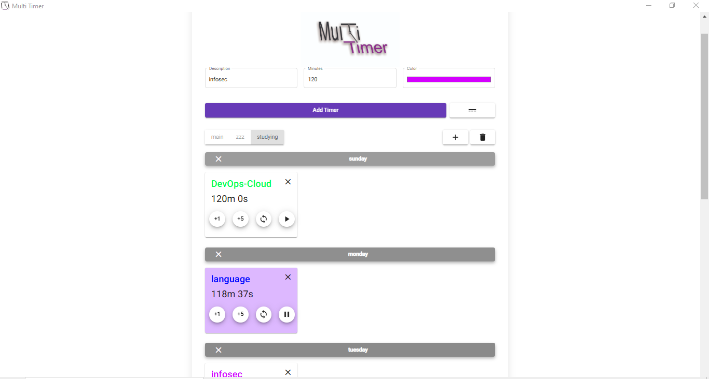

# Multi Timer



A customizable desktop timer application built with Electron and Angular that allows users to manage multiple timers simultaneously.

## Features

- **Multiple Simultaneous Timers**: Create and run several timers at once
- **Multi Pages**: Organize timers with pages like 'main', 'studying', etc.
- **Color Coding**: Assign unique colors to each timer for easy visual identification
- **Timer Controls**: Easily add/remove time and pause/play each timer
- **Customizable**: Set timer descriptions, durations, and colors to fit your needs
- **Notifications**: Desktop notifications when timers complete
- **Fully Responsive**: Interface automatically adapts to any window size
- **Always On Top**: Option to keep the window visible above other applications
- **Separators**: Visual organization with separators
- **Modern UI**: Clean and intuitive Design interface using Material ng

## Screenshots




## Installation

### Easy Installation
Download the latest installer from the [Releases](https://github.com/mostafasamir9/multi-timer-app/releases/)

### For Developers
#### Prerequisites
- Node.js (v14 or higher)
- npm (v6 or higher)

#### Setup
```bash
# Clone the repository
git clone https://github.com/mostafasamir9/multi-timer-app

# Navigate to the project directory
cd multi-timer-app

# Install dependencies
npm install
```

#### Development
The project includes several npm scripts to help with development:

- **Angular Development Server**: Run `npm start` to start the Angular development server
- **Electron Development**: Run `npm run electron` to build the Angular app and start Electron

## Usage

1. **Creating a Timer**:
   - Enter a description in the "Description" field
   - Set the duration in minutes
   - Choose a color for the timer
   - Click "Add Timer"

2. **Managing Timers**:
   - Use the +1/+5 buttons to add minutes
   - Use the refresh button to reset the timer
   - Use the play/pause button to control the timer
   - Click the X button to delete a timer


4. **Notifications**:
   - Receive desktop notifications when timers complete

5. **Window Controls**:
   - Toggle "Always on Top" to keep the timer visible while working in other applications
   - Resize the window to any dimension - the interface will automatically adapt to fit
   - Use in compact mode on a corner of your screen or expanded for better visibility

## Technology Stack

- **Electron**: Cross-platform desktop application framework
- **Angular**: Frontend web application framework
- **Angular Material**: UI component library implementing Material Design
- **CSS**: Advanced styling with responsive layout design
- **Flexbox/Grid**: Modern CSS layout techniques for perfect scaling

## Roadmap

- [x] Multiple simultaneous timers
- [x] Custom timer categories
- [x] Color coding
- [x] Desktop notifications
- [x] Sound alerts
- [x] Automatic updates
- [x] Fully responsive layout
- [x] Always on top functionality
- [x] Day separators
- [ ] Drag and drop timer organization
- [ ] Statistics and reports
- [ ] Import/export timer configurations
- [ ] Dark/light theme support
- [ ] Search functionality
- [ ] Mobile companion app

## Contributing

Contributions are welcome! Please feel free to submit a Pull Request.

1. Fork the repository
2. Create your feature branch (`git checkout -b feature/amazing-feature`)
3. Commit your changes (`git commit -m 'Add some amazing feature'`)
4. Push to the branch (`git push origin feature/amazing-feature`)
5. Open a Pull Request

## License

This project is licensed under the MIT License - see the LICENSE file for details.

## Support Me

If you like my work, you can support me by buying me a coffee!

[](https://www.buymeacoffee.com/mostafasamh)

